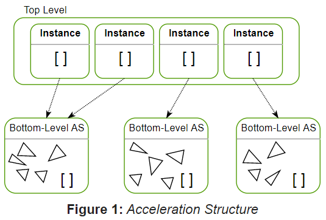
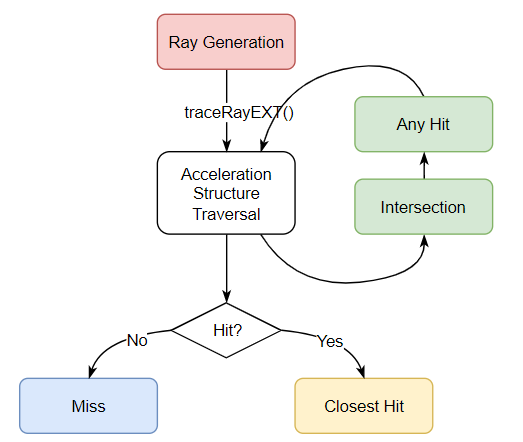
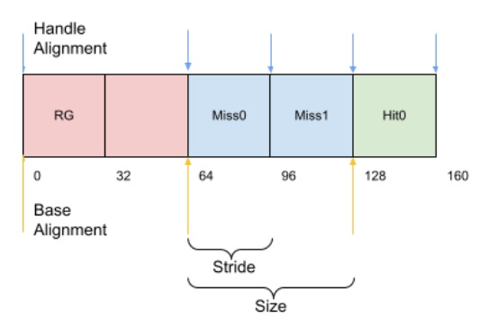

# Vulkan 光追模块

#### 1.准备部分

需要添加的device   extension:`VK_KHR_ACCELERATION_STRUCTURE_EXTENSION_NAME`,`VK_KHR_RAY_TRACING_PIPELINE_EXTENSION_NAME`以及 `VK_KHR_DEFERRED_HOST_OPERATIONS_EXTENSION_NAME  `在创建device的过程中，需要将其加到 `VkDeviceCreateInfo` 结构体的 ppEnabledExtensionNames 中。

```C++
vector<const char*> usedExtensions;
...//添加其它extension
usedExtensions.push_back();
...
VkDeviceCreateInfo createInfo{};
createInfo.ppEnabledExtensionNames = usedExtensions.data();
```


之后，我们可以通过`VkPhysicalDeviceRayTracingPipelinePropertiesKHR` 结构体取得vulkan ray tracing一些属性。具体方法为，将 `VkPhysicalDeviceRayTracingPipelinePropertiesKHR` 绑定到 `VkPhysicalDeviceProperties2` 的pNext上通过 `vkGetPhysicalDeviceProperties2` 取得。

```c++
VkPhysicalDevice physicalDevice;//已经创建好的physical device
VkPhysicalDeviceRayTracingPipelinePropertiesKHR rayTracingProp{
	VK_PHYSICAL_DEVICE_RAY_TRACING_PIPELINE_PROPERTIES_KHR
};//需要获取的光追参数
VkPhysicalDeviceProperties2 prop2{VK_STRUCTURE_TYPE_PHYSICAL_DEVICE_PROPERTIES_2};
prop2.pNext = &rayTracingProp;
vkGetPhysicalDeviceProperties2(physicalDevice,&prop2);
```

####  2.加速结构acceleration structure

在用户视角下，加速结构分为两层:全局只有一个的TLAS和装载着具体数据的BLAS:

BLAS包含了模型的顶点数据，它可以由多个vertex buffer构建，每个vertex buffer可以携带一个transform matrix信息来表示其在这个BLAS的位置偏移。

每个TLAS包含了多个instance数据，每个instance含有一个transform matrix并引用一个BLAS数据



##### 2.1 Bottom Level Acceleration Structure

###### 2.1.1 Build Bottom Level Acceleration Structure

Blas由 `VkAccelerationStructureKHR` 和 `VkBuffer` 构成，通过调用vkCmdBuildAccelerationStructuresKHR创建。在构建过程中需要初始化一下几个结构体： 

`VkAccelerationStructureGeometryKHR`  和`VkAccelerationStructureBuildRangeInfoKHR` 描述了构建BLAS需要的几何数据的格式，地址，类型等信息。（一个Model下的submesh 对应一个Geometry和BuildRangeInfo）

`VkAccelerationStructureGeometryKHR` 声明如下

```C++
typedef struct VkAccelerationStructureGeometryKHR {
    VkStructureType                           sType;//这个数据结构的类型，下同
    const void*                               pNext;//指向拓展数据结构，方便拓展，下同
    VkGeometryTypeKHR                         geometryType;//几何数据的类型
    VkAccelerationStructureGeometryDataKHR    geometry;//描述了几类几何数据的union
    VkGeometryFlagsKHR                        flags;
} VkAccelerationStructureGeometryKHR;

typedef union VkAccelerationStructureGeometryDataKHR {
    VkAccelerationStructureGeometryTrianglesDataKHR    triangles;
    VkAccelerationStructureGeometryAabbsDataKHR        aabbs;
    VkAccelerationStructureGeometryInstancesDataKHR    instances;
} VkAccelerationStructureGeometryDataKHR;
```

对于最常见的三角网格，其类型为 `VK_GEOMETRY_TYPE_TRIANGLES_KHR` ，与其对应的geometry为 `VkAccelerationStructureGeometryTrianglesDataKHR` 

```C++
typedef struct VkAccelerationStructureGeometryTrianglesDataKHR {
    VkStructureType                  sType;
    const void*                      pNext;
    VkFormat                         vertexFormat;//顶点position数据的格式
    VkDeviceOrHostAddressConstKHR    vertexData;//指向顶点数据的指针（要以position数据开头）
    VkDeviceSize                     vertexStride;//每个顶点数据的偏移量
    uint32_t                         maxVertex;//最多顶点数
    VkIndexType                      indexType;//index数据的类型
    VkDeviceOrHostAddressConstKHR    indexData;//指向index数据的指针
    VkDeviceOrHostAddressConstKHR    transformData;
} VkAccelerationStructureGeometryTrianglesDataKHR;
```

需要注意的是这里并不需要像Vertex Attributes一样把每个vertex的所有信息描述一遍，而只需要填写vertex的position数据对应的位置即可。这里的vertexData和indexData关联的buffer均需要在创建的时候设置flag  `VK_BUFFER_USAGE_ACCELERATION_STRUCTURE_BUILD_INPUT_READ_ONLY_BIT_KHR. `  否则vulkan debug layer会报错：


`VkAccelerationStructureBuildRangeInfoKHR` 的作用类似index buffer,其定义如下：

```C++
typedef struct VkAccelerationStructureBuildRangeInfoKHR {
    uint32_t    primitiveCount;
    uint32_t    primitiveOffset;
    uint32_t    firstVertex;
    uint32_t    transformOffset;
} VkAccelerationStructureBuildRangeInfoKHR;
```

其transformOffset和 `VkAccelerationStructureGeometryTrianglesDataKHR` 中的 transformData 一起，描述了一个triangle的transform信息。官方文档对其有如下解释：

- If [VkAccelerationStructureGeometryTrianglesDataKHR](https://registry.khronos.org/vulkan/specs/1.3-extensions/man/html/VkAccelerationStructureGeometryTrianglesDataKHR.html)::`transformData` is not `NULL`, a single [VkTransformMatrixKHR](https://registry.khronos.org/vulkan/specs/1.3-extensions/man/html/VkTransformMatrixKHR.html) structure is consusmed from [VkAccelerationStructureGeometryTrianglesDataKHR](https://registry.khronos.org/vulkan/specs/1.3-extensions/man/html/VkAccelerationStructureGeometryTrianglesDataKHR.html)::`transformData`, at an offset of `transformOffset`. This matrix describes a transformation from the space in which the vertices for all triangles in this geometry are described to the space in which the acceleration structure is defined.

填写好模型的描述信息后，我们可以开始着手构建acceleration structure。

对于每个BlAS,我们在构建时需要一个对应的 `VkAccelerationStructureBuildGeometryInfoKHR`,`VkAccelerationStructureBuildSizesInfoKHR` 以及对应的一系列`VkAccelerationStructureBuildRangeInfoKHR` （每个submesh一个）。

`VkAccelerationStructureBuildGeometryInfoKHR` 定义如下：

```C++
typedef struct VkAccelerationStructureBuildGeometryInfoKHR {
    VkStructureType                                     sType;
    const void*                                         pNext;
    VkAccelerationStructureTypeKHR                      type;//被构建的acceleration structure的类型(BLAS或TLAS)
    VkBuildAccelerationStructureFlagsKHR                flags;//一些调整build过程的flag
    VkBuildAccelerationStructureModeKHR                 mode;//build的模式（更新或完全重建）
    VkAccelerationStructureKHR                          srcAccelerationStructure;//更新时的源AS
    VkAccelerationStructureKHR                          dstAccelerationStructure;//输出AS
    uint32_t                                            geometryCount;//几何数据的数量
    
    //具体数据，具体细节可以看官网https://registry.khronos.org/vulkan/specs/1.3-extensions/man/html/VkAccelerationStructureBuildGeometryInfoKHR.html
    const VkAccelerationStructureGeometryKHR*           pGeometries;
    const VkAccelerationStructureGeometryKHR* const*    ppGeometries;
    VkDeviceOrHostAddressKHR                            scratchData;
} VkAccelerationStructureBuildGeometryInfoKHR;
```

`VkAccelerationStructureBuildSizesInfoKHR`  定义如下：

```C++
// Provided by VK_KHR_acceleration_structure
typedef struct VkAccelerationStructureBuildSizesInfoKHR {
    VkStructureType    sType;
    const void*        pNext;
    VkDeviceSize       accelerationStructureSize;//dstAccelerationStructure关联的buffer的size
    VkDeviceSize       updateScratchSize;//update操作需要的scratch buffer大小
    VkDeviceSize       buildScratchSize;//build操作需要的scratch buffer大小
} VkAccelerationStructureBuildSizesInfoKHR;
```

scratch buffer是什么官方文档没有明确的解释，我个人认为它是用来存放build过程中产生数据的临时buffer需要在build之前构建并在build之后释放。在创建scratch buffer时至少需要两个flag:` VK_BUFFER_USAGE_STORAGE_BUFFER_BIT` (https://vulkan.lunarg.com/doc/view/1.3.216.0/windows/1.3-extensions/vkspec.html#VUID-vkCmdBuildAccelerationStructuresKHR-pInfos-03674) 和 `VK_BUFFER_USAGE_SHADER_DEVICE_ADDRESS_BIT` (为了获取device address)。

`VkAccelerationStructureBuildSizesInfoKHR` 的信息可以通过vkGetAccelerationStructureBuildSizesKHR 获取。

总的来说，构建Blas的流程如下(下面的代码中(A,B)代表A,B组成的元组)：

```c++
vector<(vector<VkAccelerationStructureGeometryKHR>,vector<VkAccelerationStructureBuildRangeInfoKHR>)>      geometies;
...//遍历场景中模型数据获得geometry和build range信息(一个vector<VkAccelerationStructureGeometryKHR>对应一个Blas)
uint32_t nBlas = geometries.size();

vector<(VkAccelerationStructureBuildGeometryInfoKHR,VkAccelerationStructureBuildSizesInfoKHR)> buildInfos;
for(int i = 0;i < nBlas;i++){
    VkAccelerationStructureBuildGeometryInfoKHR  buildInfo;
    ...//填写buildInfo
    buildGeometryInfos.push_back(buildInfo);
    VkAccelerationStructureBuildSizesInfoKHR sizeInfo;
    vkGetAccelerationStructureBuildSizesKHR(...);//获取sizeInfo
    buildInfos.push_back((buildInfo,sizeInfo));
}

Buffer scratchBuffer = createBuffer(...);//根据build size info中scratch buffer的最大值创建一个所有blas共用的scratch buffer(Buffer是指封装了VkBuffer和VkMemory的buffer)

vector<(VkAccelerationStructureKHR,Buffer)> blases;
//实际实现时可以分批进行，避免太频繁的submit
for(int i = 0;i < nBlas;i++){
    VkCommandBuffer cmdBuffer;//从command pool中分配一个command buffer用来记录
    Buffer buffer = createBuffer(...);//根据build size info的buffer size创建buffer
    VkAccelerationStructureCreateInfoKHR createInfo;
    VkAccelerationStructureKHR as;
    ...//填写createInfo,type为VK_ACCELERATION_STRUCTURE_TYPE_BOTTOM_LEVEL_KHR
    vkCreateAccelerationStructureKHR(device,&createInfo,nullptr,&as);//创建acceleration structure
    buildInfos[i].0.dstAccelerationStructure = as;//输出as
    buildInfos[i].0.scratchData.deviceAddress = getDeviceAddress(scratchBuffer);//需要的scratch buffer
    
    vkCmdBuildAccelerationStructuresKHR(cmdBuffer,1,&buildInfos[i].0,&geometies[i].1.data());
    ...//一些buffer需要memory barrier操作
    submit(cmdBuffer);//将command buffer送到command queue以执行
}
```

###### 2.1.2 Build Compacted Bottom Level Acceleration Structure

除上述方法之外我们还可以构建一种数据组织的更紧凑的BLAS。（TODO）

##### 2.2 Build Top Level Acceleration Structure

与Blas相同一个Tlas由`VkAccelerationStructureKHR` 和 `VkBuffer` 构成，通过调用vkCmdBuildAccelerationStructuresKHR构建。

构建Tlas同样需要通过`VkAccelerationStructureBuildGeometryInfoKHR` 描述几何信息。与Blas不同的是，一个Tlas只有一个geometry （`geometryCount` 为1）-- `VkAccelerationStructureGeometryInstancesDataKHR` 。其定义如下：

```C++
typedef struct VkAccelerationStructureGeometryInstancesDataKHR {
    VkStructureType                  sType;
    const void*                      pNext;
    VkBool32                         arrayOfPointers;
    VkDeviceOrHostAddressConstKHR    data;
} VkAccelerationStructureGeometryInstancesDataKHR;
```

其中data为指向该Tlas下所有instance的buffer的指针。每个instance由一个`VkAccelerationStructureInstanceKHR` 描述：

```C++
typedef struct VkAccelerationStructureInstanceKHR {
    VkTransformMatrixKHR          transform;//这个instance的transform的矩阵
    uint32_t                      instanceCustomIndex:24;//instance的index
    uint32_t                      mask:8;//求交时 ray.mask & instance.mask != 0 时才会相交
    uint32_t                      instanceShaderBindingTableRecordOffset:24;
    VkGeometryInstanceFlagsKHR    flags:8;
    uint64_t                      accelerationStructureReference;//这个instance的mesh在blas中的index
} VkAccelerationStructureInstanceKHR;
```

同时，对于Tlas一个instance为一个primitive,因此`VkAccelerationStructureBuildRangeInfoKHR` 中`primitiveCount`  为 instance数量，其余值为0。

其余部分，Tlas和Blas几乎相同，可以参照构建Blas的代码实现。

#### 3.Ray Tracing Pipeline

一个ray tracing pipeline 如下图所示：



总的来说，rt pipeline一共有5类shader

1. ray generation shader:对render target上每个pixel调用。整个光追流程的入口，通过该shader生成光线，向render target写入颜色。
2. intersection shader: 主要用来与用户自定义的非三角网格几何体做相交测试（如隐式描述的几何体表面）
3. any hit shader:一个ray的intersection可能有很多结果，由这个shader从这些结果中挑选出一个返回给cloest hit shader。对于内置的any hit shader，会返回离ray出发点最近的相交点。
4. Miss shader:当ray没有击中场景时执行
5. Closest Hit Shader:当ray击中场景时执行

##### 3.1 Create Ray Tracing Pipeline and Shader Binding Table

在ray tracing中shader不再是像光栅化管线一样一个阶段一个shader的执行，而是所有shader放在一起形成一个shader binding table(SBT)，再在每次`traceRayExt`中根据相交测试的结果从SBT中选择相应的shader执行。

在创建SBT之前，需要创建ray tracing pipeline，`VkRayTracingPipelineCreateInfoKHR` 定义如下：

```C++
typedef struct VkRayTracingPipelineCreateInfoKHR {
    VkStructureType                                      sType;
    const void*                                          pNext;
    VkPipelineCreateFlags                                flags;
    uint32_t                                             stageCount;//shader stage的数量
    const VkPipelineShaderStageCreateInfo*               pStages;//shader stage的指针
    uint32_t                                             groupCount;//shader group数量
    const VkRayTracingShaderGroupCreateInfoKHR*          pGroups;//shader group的指针
    uint32_t                                             maxPipelineRayRecursionDepth;//最大递归深度
    const VkPipelineLibraryCreateInfoKHR*                pLibraryInfo;
    const VkRayTracingPipelineInterfaceCreateInfoKHR*    pLibraryInterface;
    const VkPipelineDynamicStateCreateInfo*              pDynamicState;
    VkPipelineLayout                                     layout;//pipeline对应的layout
    VkPipeline                                           basePipelineHandle;
    int32_t                                              basePipelineIndex;
} VkRayTracingPipelineCreateInfoKHR;
```

其中，除了sType没带注释的成员是选填的，我们也会重关注这些部分。

与graphics pipeline相同，我们需要为ray trace pipeline中每一个shader创建一个`VkPipelineShaderStageCreateInfo`。同时，我们还需要为这些shader创建Shader Group，`VkRayTracingShaderGroupCreateInfoKHR` 的定义如下

```C++
typedef struct VkRayTracingShaderGroupCreateInfoKHR {
    VkStructureType                   sType;
    const void*                       pNext;
    VkRayTracingShaderGroupTypeKHR    type;
    uint32_t                          generalShader;//general shader在pStages中的index
    uint32_t                          closestHitShader;//closest hit shader在pStages中的index
    uint32_t                          anyHitShader;//any hit shader在pStages中的index
    uint32_t                          intersectionShader;//intersection shader在pStages中的index
    const void*                       pShaderGroupCaptureReplayHandle;
} VkRayTracingShaderGroupCreateInfoKHR;
```

在相交测试过程中，intersection shader，any hit shader和closest hit shader三个shader是紧密关联在一起的，它们会打包成一个shader group并形成一个handle（如对一个不透明球光线追踪，需要一个intersection shader和closest hit shader，它们可以打包成一个shader group并在shader代码中用一个handle引用）。而其它类型的shader(如ray generation和miss)则都是general shader，它们一个shader对应一个shader group。

在填写好`VkRayTracingPipelineCreateInfoKHR`后我们可以通过`vkCreateRayTracingPipelinesKHR` 创建ray tracing pipeline。

```c++
vkCreateRayTracingPipelinesKHR(device,{},{},1,&rtCreateInfo,nullptr,&rtPipeline);
```

在创建好shader stage，shader group以及ray tracing pipeline后，我们可以开始创建shader binding table。shader binding table就是一个装了若干shader group handle的buffer,在shader 代码中通过index来查找。vulkan对SBT的aligment有要求，这些信息可以在`VkPhysicalDeviceRayTracingPipelinePropertiesKHR` 中获取。一个shader binding table的内存分布如下图所示：



在SBT创建的过程中我们需要`VkPhysicalDeviceRayTracingPipelinePropertiesKHR` 中的三种信息：

1. `shaderGroupHandleSize`，每个shader group handle的大小。
2. `shaderGroupHandleAlignment` 在SBT中每个shader group handle的stride都需要一个alignment因此每个shader group handle的stride大小为

````c++
//prop为VkPhysicalDeviceRayTracingPipelinePropertiesKHR
handleStride = align_up(prop.shaderGroupHandleSize,prop.shaderGroupHandleAlignment);
````

   3.`shaderGroupBaseAlignment` 每个SBT会根据不同的shader group类型(ray gen,hit,miss,callable)分为各个区域(上图中不同颜色标注的区域)，而每个区域之间需要有alignment。因此，每个区域之间的stride为：

```c++
//prop为VkPhysicalDeviceRayTracingPipelinePropertiesKHR
//regionHandleCount为该区域中shader group handle的数量
regionStride = align_up(handleStride * regionHandleCount,prop.shaderGroupBaseAlignment);
```

总的来说，创建sbt的伪代码如下

```c++
//sbt内存布局
uint32 rayGenRegionStart  ,rayGenStride  ,rayGenSize;
uint32 hitRegionStart     ,hitStride     ,hitSize;
uint32 missRegionStart    ,missStride    ,missSize;
uint32 callableRegionStart,callableStride,callableSize;
//关于callable shader可以看https://www.reddit.com/r/vulkan/comments/gtqrym/use_case_for_callable_shaders
calculateMemoryRegions();//计算各个区域的内存布局

vector<unsigned char> shaderGroupHandles(handleCount * handleSize);
vkGetRayTracingShaderGroupHandlesKHR(device,rtPipeline,0,shaderGroupHandles.data(),shaderGroupHandles.size());//获取rtPipeline中的shader group handle数据。shader group handle的顺序和VkRayTracingShaderGroupCreateInfoKHR 中pGroups的顺序相同。

Buffer SBT = createBuffer(...);//创建buffer，需要flag VK_BUFFER_USAGE_SHADER_BINDING_TABLE_BIT_KHR
void* sbtData = SBT.map(...);//将buffer 内存map到cpu
copyShaderGroupData();//将shaderGroupHandles中数据复制到stbData中
```

##### 3.2 Ray Trace Command

与光栅化管线不同，光追并不需要render pass。可以在`vkAcquireNextImageKHR` 之后直接开始渲染。

```C++
vkAcquireNextImageKHR(...);//acquire下一帧
auto cmdBuf = getCommandBuffer(...);//获取当前帧的command buffer
rayTrace(cmdBuf);//记录光追命令
```

在`rayTrace`中我们需要通过调用`vkCmdTraceRaysKHR`进行光追。`vkCmdTraceRaysKHR` 需要sbt各个region的deviceaddress。我们可以通过3.1中sbt的内存布局计算得到：

```c++
VkStridedDeviceAddressRegionKHR hitRegion,missRegion,rayGenRegion,callableRegion;
VkDeviceAddress sbtAddress;//通过vkGetBufferDeviceAddress获得

hitRegion.stride = hitStride,hitRegion.deviceAddress = sbtAddress + hitRegionStart,hitRegion.size = hitSize;
...
    
vkCmdTraceRaysKHR(cmdBuf,&rayGenRegion,&missRegion,&hitRegion,&callRegion,screenWidth,screenHeight,1);
```

#### 4.Ray Tracing GLSL

首先在最开始需要开启glsl的光追模块

```glsl
#extension GL_EXT_ray_tracing : require
```

在ray tracing 中通过调用`traceRayExt` 生成光线，而光线击中场景后又会去调用相应的shader。这样两个shader之间形成了类似调用和被调用的关系。调用者和被调用者之间通过pay load交换数据。调用者可以声明多个`rayPayloadEXT` (一个location一个pay load),并在`traceRayExt` 中让一个`rayPayloadExt`可见，在被调用者中声明`rayPayloadInEXT` 来接收这个数据。

```glsl
//caller
layout(location = 0) rayPayloadInEXT bool payload;
void main(){
    traceRayExt(
    	...,
        0 //在location 0的pay load对下一个shader可见
    );
    //现在payload = false
}
//caller end

//callee
layout(location = 0) rayPayloadInEXT bool payload;
void main(){
    //在callee中可以通过payload与caller交换数据
    payload = false;
}
//callee end
```

`traceRayExt` 的参数如下（具体可以看https://github.com/KhronosGroup/GLSL/blob/master/extensions/ext/GLSL_EXT_ray_tracing.txt）(之后的讨论围绕$ray=dir * t + origin$ 展开)

- `tlas : accelerationStructureEXT `  需要trace的场景的tlas
- `flags` trace过程中的flag如`gl_RayFlagsSkipClosestHitShaderEXT`(跳过closest hit shader), `gl_RayFlagsTerminateOnFirstHitEXT`(在第一次击中就结束)等。
- `mask : uint8` 光线的mask和tlas中的mask(见2.2)对应。当光线的mask能覆盖instance的mask时光线才能击中。
- `sbtRecordOffset : uint` hit shader的offset
- `sbtRecordStride : uint` hit shader的stride。和offset一起决定hit的时候选用哪个hit shader。这个过程相当复杂具体可以看https://www.willusher.io/graphics/2019/11/20/the-sbt-three-ways Hit Group Shader Record Index Calculation 部分
- `origin : vec3` ray的出发点
- `minRange : float` ray的t的最小值
- `dir : vec3`  ray的方向
- `maxRange : float` ray的t的最大值
- `payload : const uint` payload 的 location 

除此以外，glsl提供了一些有用的内置值(具体可以看https://github.com/KhronosGroup/GLSL/blob/master/extensions/ext/GLSL_EXT_ray_tracing.txt)：

- `gl_LaunchIDEXT : uint2`  当前该shader的pixel id

- `gl_LaunchSizeEXT : uint2` vkCmdTraceRaysKHR命令中传入的width和height

- `gl_InstanceCustomIndexEXT : uint` 在closest hit shader中，被击中的instance的index

- `gl_PrimitiveID : uint` 在closest hit shader中，instance中被击中的三角形的id(对三角形网格来说) 

- `gl_ObjectToWorldEXT : Mat4x4 ` 在closest hit shader中， instance从object空间到world空间的变换矩阵

- `gl_WorldToObjectEXT : Mat4x4`在closest hit shader中，instance从world空间到object空间的变换据矩阵

- `gl_WorldRayOriginEXT : vec3 ` 在closest hit shader中，击中该点的ray的世界坐标

- `gl_WorldRayDirectionEXT : vec3` 在closest hit shader中，击中该点的ray的世界方向

- `gl_HitTEXT : float` 在closest hit shader中，击中该点的ray的t值

- `hitAttributeEXT` 修饰符，修饰存储了ray和instance相交点的信息。被修饰的变量只能在instance shader中写入，在closest hit shader和any hit shader中读取。在instance shader缺省，与三角形网格求交的过程中，会有一个`hitAttributeEXT vec2 uv`传入closest hit和any hit shader。通过它可以获取当前相交点的uv值。(https://github.com/KhronosGroup/SPIRV-Registry/blob/main/extensions/KHR/SPV_KHR_ray_tracing.asciidoc 5339部分)例如：

  ```glsl
  //a closest hit shader
  #extension GL_EXT_ray_tracing : require
  ...
  
  hitAttributeEXT vec2 localUv;
  ...
  
  void main(){
  	vec2 uv0,uv1,uv2;
  	vec2 uv = uv0 * (1.0 - localUv.x -localUv.y) + uv1 * localUv.x + uv2 * localUv.y;
      ...
  }
  
  ```

  
